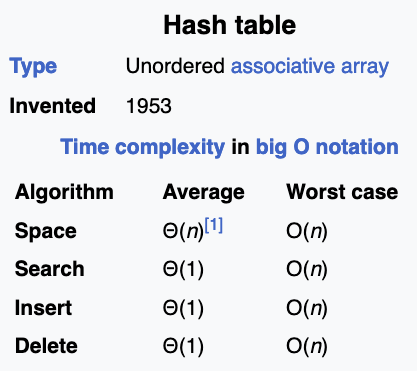

# Mid Term Note

## Week 1

One loop -> **O(n)**

Two loop -> **O(n^2)**

`a = a + b` -> **Constant time**.

Upper bound -> **indicate worst-case scenario**.


Binary Search

- Time complexity: O(log n).
  - Because it half the list/array.

Mechanism

- Getting middle point by halving left(key is smaller) and right(key is greater)
  - Until middle point is equal to key

```python
import time
K = int(input())
a = list(map(int, input().split()))

st = time.process_time()
a.sort()

def BinSrch(key, p, r):
    while p <= r:
        q = (p + r) // 2
        if a[q] == key:
            return True, q
        elif key < a[q]:
            r = q - 1
        else:
            p = q + 1
    return False, -1

found = False
for x in a:
    y = K / x
    found, j = BinSrch(y, 0, len(a) - 1)
    if found:
        break

et = time.process_time()
if not found:
    print("No pair multiplies to k")
else:
    print(x, int(y))
print(et - st)
```

## Week 2

Insertion

Time complexity: **O(n^2)**

- `for i in range(1, len_n):`

  - `while j >= 0 and key < my_list[j]:`
    - are running **O(n)** -> **O(n^2)**

- Going N time **O(n)**
- Checking the left side of an element N time **O(n)**

Mechanism

- Get element; if element is less than left element of it.
- Swap until the element is no longer small than its left

```python
def insertion_sort(my_list, len_n):
    for i in range(1, len_n):
        key = my_list[i]
        j = i - 1

        while j >= 0 and key < my_list[j]:
            my_list[j + 1] = my_list[j]
            j -= 1
        my_list[j + 1] = key


insertion_sort(a, n)
```

Merge sort

Time complexity: **O(n log n)**

- **N** because it check N time for left and right
  - `while i < len(left_list) and j < len(right_list)`
- **log n** because it half the list/array

Mechanism

- Halves the array/list and sort them.

```python
# Mine version
def merge(int_list, left_list, right_list):
    i = 0
    j = 0
    k = 0

    while i < len(left_list) and j < len(right_list):
        if left_list[i] > right_list[j]:
            int_list[k] = right_list[j]
            j += 1
        else:
            int_list[k] = left_list[i]
            i += 1
        k += 1

    while i < len(left_list):
        int_list[k] = left_list[i]
        i += 1
        k += 1

    while j < len(right_list):
        int_list[k] = right_list[j]
        j += 1
        k += 1


def merge_sort(int_list):
    if len(int_list) > 1:
        mid_point = len(int_list) // 2
        left_list = int_list[:mid_point]
        right_list = int_list[mid_point:]

        merge_sort(left_list)
        merge_sort(right_list)
        merge(int_list, left_list, right_list)
```

```python
# Arjan version
import time

def merge(A, p, q, r):
    B = []
    i = p
    j = q + 1
    while i <= q and j <= r:
        if A[i] <= A[j]:
            B.append(A[i])
            i += 1
        else:
            B.append(A[j])
            j += 1
    A[p : r + 1] = B + A[i : q + 1] + A[j : r + 1]


def mergesort(A, p, r):
    if p < r:
        q = (p + r) // 2
        mergesort(A, p, q)
        mergesort(A, q + 1, r)
        merge(A, p, q, r)
        print(A[p: r+1])

a = list(map(int, input().split()))

st = time.process_time()
mergesort(a, 0, len(a) - 1)
et = time.process_time()

# print(a)
print(et - st)
```

Is there an advantage of insertion sort over merge sort?

Merge sort takes up the space complexity while insertion sort does not.

## Week 3

Selection sort

Time complexity: **O(n^2)**

Mechanism

- Go **N** time to find smaller/largest element and swap with outer loop index

- Outer loop has one counter which checks with inner loop counter

```python
# Arjan
import time

A = list(map(int, input().split()))
n = len(A)

def checkoutMax(a, lastIndex=0):
    # Locate the position of max item
    # Replace the item at max position with the last item
    # Return value of max item

    maxIndex = 0
    for i in range(1, lastIndex + 1):
        if a[i] > a[maxIndex]:
            maxIndex = i
    maxItem = a[maxIndex]
    a[maxIndex] = a[lastIndex]
    return maxItem


st = time.process_time()
for i in range(n - 1, -1, -1):
    A[i] = checkoutMax(A, i)

et = time.process_time()
print(A)
print(et - st)
```

```python
# Mine
def swap(my_list, a, b):
    temp = my_list[a]
    my_list[a] = my_list[b]
    my_list[b] = temp


for j in range(len(my_list)):
    i_min = j

    for i in range(j + 1, len(my_list)):
        if my_list[i] < my_list[i_min]:
            i_min = i

    swap(my_list, j, i_min)
```

Heap sort

Time complexity: **O(n log n)**

- **log n** because height of the tree and **N** because when you extract you have to get the last element from the heap; that is **N** time.

```python
import time


class Heap:
    def __init__(self, items=None):
        self.a = items[:] if items is not None else []
        self.heap_size = len(self.a)
        self.build_heap()

    @staticmethod
    def compare(x, y):
        return x > y

    def empty(self):
        return self.heap_size == 0

    def heapify_up(self, i):
        while i > 0:
            parent = (i - 1) // 2
            if self.compare(self.a[i], self.a[parent]):
                self.a[i], self.a[parent] = self.a[parent], self.a[i]
                i = parent
            else:
                break

    def heapify_down(self, i):
        while True:
            smallest = i
            left_child = 2 * i + 1
            right_child = 2 * i + 2

            if left_child < self.heap_size and self.compare(
                self.a[left_child], self.a[smallest]
            ):
                smallest = left_child

            if right_child < self.heap_size and self.compare(
                self.a[right_child], self.a[smallest]
            ):
                smallest = right_child

            if smallest == i:
                break

            self.a[i], self.a[smallest] = self.a[smallest], self.a[i]
            i = smallest

    def insert(self, x):
        self.heap_size += 1
        if len(self.a) < self.heap_size:
            self.a.append(x)
        else:
            self.a[self.heap_size - 1] = x
        self.heapify_up(self.heap_size - 1)

    def extract(self):
        if self.empty():
            raise ValueError("Error: Heap is empty")
        x = self.a[0]
        self.a[0] = self.a[self.heap_size - 1]
        self.heap_size -= 1
        self.heapify_down(0)
        return x

    def build_heap(self):
        for i in range(self.heap_size // 2 - 1, -1, -1):
            self.heapify_down(i)


A = list(map(int, input().split()))

st = time.process_time()
h = Heap(items=A)

total = 0
for i in range(len(A) - 1, -1, -1):
    A[i] = h.extract()

et = time.process_time()
print(A)
print(et - st)
```

## Week 4

Quick sort

Time complexity: Average -> **O(n \* log n)**, Worst -> **O(n^2)**

Mechanism

- Find pivot(last element)
  - if the element is less than pivot
    - replace it self `a[i], a[j] = a[j], a[i]`
  - `a[r], a[i + 1] = a[i + 1], a[r]` swap position with "not less the pivot"

```python
import sys
sys.setrecursionlimit(10000) # optional

def partition(a, p, r):  # Lomuto's partition scheme
    x = a[r]
    i = p - 1
    for j in range(p, r):
        if a[j] <= x:
            i += 1
            a[i], a[j] = a[j], a[i]
    a[r], a[i + 1] = a[i + 1], a[r]
    return i + 1


def quick_sort(a, p, r):
    # r -> last element, len(A), pivot
    # p -> starting position, 0
    if p < r:
        q = partition(a, p, r) # returns a pivot index
        # print(A[p:q], A[q], A[q + 1:r + 1])
        quick_sort(a, p, q - 1) # left side
        quick_sort(a, q + 1, r) # right side

A = list(map(int, input().split()))
print(f"Input: {A}")
quick_sort(A, 0, len(A) - 1)
print(A)
```

What do you conclude as the upper bound of the quick sort’s running time when the input is already sorted?

Pivot is always large therefore, quick sort has to go **N** time.

What do you conclude as the upper bound of the quick sort’s running time when the input is already sorted but in reverse order?

Pivot is always small therefore, quick sort has to go **N** time.

Examine the code of quick sort. What do see as advantage and disadvantage when compared with merge sort?

Quick sort replace in the array making it more less space complexity than merge sort

## Week 5

Hash

Time complexity:



```python
from sys import stdin

operations = []
for line in stdin:
    line = line.split()
    if len(line) > 2:
        line[2] = int(line[2])
    operations.append(line)

table_size = 10  # set table size here
hash_table = [[] for i in range(table_size)]


# s -> roman-number (string)
# v -> number to insert (int)
def show_hash_table():
    print("-------------------")
    for item_list in hash_table:
        print(item_list)
    print("-------------------")


def hash_func(s):
    more_than_two_character_sum = sum([ord(i) for i in s])
    return more_than_two_character_sum % table_size


def insert(s, v):
    # return 0 on successful insertion
    # return -1 if s has already been in the hash table
    if search(s) != -1:
        return -1
    else:
        hash_value = hash_func(s)
        sub_list = hash_table[hash_value]
        sub_list.append((s, v))
        return 0


def search(s):
    # return value of the key or
    # return -1 if s does not exist in hash table
    hash_value = hash_func(s)
    sub_list = hash_table[hash_value]
    for i in range(len(hash_table[hash_value])):
        if sub_list[i][0] == s:
            return sub_list[i][1]
    return -1


def delete(s):
    # return 0 on successful deletion
    # return -1 if s does not exist in hash table
    if search(s) == -1:
        return -1
    else:
        hash_value = hash_func(s)
        sub_list = hash_table[hash_value]
        for i in range(len(sub_list)):
            if sub_list[i][0] == s:
                del sub_list[i]
                break
        return 0


for op in operations:
    operation_command = op[0]
    if operation_command == "insert":
        insert(op[1], op[2])
    elif operation_command == "search":
        search(op[1])
    elif operation_command == "delete":
        delete(op[1])

show_hash_table()
```

## Week 6

Binary Search Tree

```python
# Arjan code
import sys

sys.setrecursionlimit(10001)

root = None


class Node:
    def __init__(self, key, data=None):
        self.key = key
        self.data = data
        self.p = None
        self.left = None
        self.right = None


def Inorder_Tree_Walk(x):
    if x is not None:
        Inorder_Tree_Walk(x.left)
        print(x.key)
        Inorder_Tree_Walk(x.right)


def Tree_Minimum(x):
    while x.left is not None:
        x = x.left
    return x


def Tree_Maximum(x):
    while x.right is not None:
        x = x.right
    return x


def Tree_Successor(x):
    if x.right is None:
        return Tree_Minimum(x.right)
    y = x.p
    while y is not None and x == y.right:
        x = y
        y = y.p
    return y

def Tree_Predecessor(x):
    if x.left is not None:
        return Tree_Maximum(x.left)
    y = x.p
    while y is not None and x == y.left:
        x = y
        y = y.p
    return y

def Transplant(u, v):
    global root

    if u.p is None:
        root = v
    elif u == u.p.left:
        u.p.left = v
    else:
        u.p.right = v

    if v is not None:
        v.p = u.p


def Tree_Delete(z):
    if z.left is None:
        Transplant(z, z.right)
    elif z.right is None:
        Transplant(z, z.left)
    else:
        y = Tree_Minimum(z.right)

        if y.p != z:
            Transplant(y, y.right)
            y.right = z.right
            y.right.p = y
        Transplant(z, y)
        y.left = z.left
        y.left.p = y


def Tree_Search(x, k):
    global root

    while x is not None and k != x.key:
        if k < x.key:
            x = x.left
        else:
            x = x.right
    return x


def Tree_Insert(z):
    global root

    y = None
    x = root

    while x is not None:
        y = x

        if z.key < x.key:
            x = x.left
        else:
            x = x.right

    z.p = y
    if y is None:
        root = z
    elif z.key < y.key:
        y.left = z
    else:
        y.right = z


# Function to print
def printCall(node, indent, last):
    if node is not None:
        print(indent, end=" ")
        if last:
            print("R----", end=" ")
            indent += "     "
        else:
            print("L----", end=" ")
            indent += "|    "

        print(str(node.key))
        printCall(node.left, indent, False)
        printCall(node.right, indent, True)


# Function to call print
def print_BSTree(root):
    printCall(root, "", True)


def main():
    x = Node(56, "HELLO_56")
    node_1 = Node(18, "Hello")
    node_2 = Node(27)
    node_3 = Node(26)

    Tree_Insert(x)
    Tree_Insert(node_3)
    Tree_Insert(Node(200))
    Tree_Insert(node_1)
    Tree_Insert(Node(28, ""))
    Tree_Insert(Node(190))
    Tree_Insert(Node(213))
    Tree_Insert(Node(12))
    Tree_Insert(Node(24))
    Tree_Insert(node_2)

    print(f"Search: {Tree_Search(x, 28).data}")

    print("Before delete")
    print_BSTree(x)

    Tree_Delete(node_1)

    print("After delete")
    print_BSTree(x)

    # Not working
    sus = Tree_Successor(node_3) # left of node and then the right most
    print(sus.key)


main()
```

```python
# Mine
class Node:
    def __init__(self, key, data=None):
        self.key = key
        self.data = data
        self.left = None
        self.right = None


class BinarySearchTree:
    def __init__(self):
        self.root = None

    def search(self, key):
        return self.find_node(self.root, key)

    def remove(self, key):
        node = self.find_node(self.root, key)
        if node:
            print(f"Removed {key}")
            self.remove_helper(self.root, key)
        else:
            print(f"{key} could not be found")

    def find_node(self, node, key):
        if node is None:
            return None
        elif node.key == key:
            return node
        elif key < node.key:
            return self.find_node(node.left, key)
        else:
            return self.find_node(node.right, key)

    def remove_helper(self, root, key):
        if root is None:
            return root
        elif key < root.key:
            root.left = self.remove_helper(root.left, key)
        elif key > root.key:
            root.right = self.remove_helper(root.right, key)
        # node found
        else:
            # leaf node
            if root.left is None and root.right is None:
                root = None
            elif root.right is not None:
                root.key = self.successor(root)
                root.right = self.remove_helper(root.right, root.key)
            elif root.left is not None:
                root.key = self.predecessor(root)
                root.left = self.remove_helper(root.left, root.key)

        return root

    @staticmethod
    def successor(node):
        current = node.right
        while current.left is not None:
            current = current.left
        return current.key

    @staticmethod
    def predecessor(root):
        root = root.left
        while root.right is not None:
            root = root.right
        return root.key

    def insert(self, node):
        self.root = self.insert_helper(self.root, node)

    def insert_helper(self, root, node):
        if root is None:
            return node

        if node.key < root.key:
            root.left = self.insert_helper(root.left, node)
        else:
            root.right = self.insert_helper(root.right, node)

        return root

    def maximum(x):
        while x.right is not None:
            x = x.right
        return x

    def minimum(x):
        while x.left is not None:
            x = x.left
        return x

    def print_call(self, node, indent, last):
        if node is not None:
            print(indent, end=" ")
            if last:
                print("R----", end=" ")
                indent += "     "
            else:
                print("L----", end=" ")
                indent += "|    "

            print(str(node.key))
            self.print_call(node.left, indent, False)
            self.print_call(node.right, indent, True)

    def print_tree(self):
        self.print_call(self.root, "", True)


def main():
    tree = BinarySearchTree()
    key_list = [4, 2, 1, 6, 5, 7, 3]
    data_list = [
        "Hello",
        "World",
        "Programmer",
        "New",
        "Jan",
        "Ton",
        "Something",
    ]
    for i in range(len(key_list)):
        tree.insert(Node(key_list[i], data_list[i]))

    search_key = 1
    search_node = tree.search(search_key)
    if search_node:
        print(f"Search {search_key}: {search_node.data}")
    else:
        print(f"Search {search_key}: Not Found")

    remove_key = 6
    tree.remove(remove_key)

    tree.print_tree()

    search_key = 4
    search_node = tree.search(search_key)

    sus = tree.successor(search_node)
    print(sus)


main()
```

## Week 7

Binary Search Tree

The upper bound on the running time of each search for a binary search tree is O(log n)

```python
import sys
import random
import time

sys.setrecursionlimit(10001)


class BST_Node:
    def __init__(self, key, data=None):
        self.key = key
        self.data = data
        self.p = None
        self.left = None
        self.right = None


class BSTree:
    def __init__(self):
        self.root = None

    def Tree_Maximum(self, x):
        while x.right is not None:
            x = x.right
        return x

    def Tree_Minimum(self, x):
        while x.left is not None:
            x = x.left
        return x

    def Transplant(self, u, v):
        if u.p is None:
            self.root = v
        elif u == u.p.left:
            u.p.left = v
        else:
            u.p.right = v
        if v is not None:
            v.p = u.p

    def Tree_Delete(self, z):
        if z.left is None:
            self.Transplant(z, z.right)
        elif z.right is None:
            self.Transplant(z, z.left)
        else:
            y = self.Tree_Minimum(z.right)
            if y.p != z:
                self.Transplant(y, y.right)
                y.right = z.right
                y.right.p = y
            self.Transplant(z, y)
            y.left = z.left
            y.left.p = y

    def Tree_Insert(self, z):
        y = None
        x = self.root
        while x is not None:
            y = x
            if z.key < x.key:
                x = x.left
            else:
                x = x.right
        z.p = y
        if y is None:
            self.root = z
        elif z.key < y.key:
            y.left = z
        else:
            y.right = z

    def Tree_Successor(self, x):
        if x.right is not None:
            return self.Tree_Minimum(x.right)
        y = x.p
        while y is not None and x == y.right:
            x = y
            y = y.p
        return y

    def Tree_Predecessor(self, x):
        if x.left is not None:
            return self.Tree_Maximum(x.left)
        y = x.p
        while y is not None and x == y.left:
            x = y

    def Tree_Search(self, k):
        x = self.root
        while x is not None and k != x.key:
            if k < x.key:
                x = x.left
            else:
                x = x.right
        return x

    def Inorder_Tree_Walk(self, x):
        if x is not None:
            self.Inorder_Tree_Walk(x.left)
            print(x.key)
            self.Inorder_Tree_Walk(x.right)

    # Function to print
    def __printCall(self, node, indent, last):
        if node is not None:
            print(indent, end=" ")
            if last:
                print("R----", end=" ")
                indent += "     "
            else:
                print("L----", end=" ")
                indent += "|    "

            print(str(node.key))
            self.__printCall(node.left, indent, False)
            self.__printCall(node.right, indent, True)

    # Function to call print
    def print_BSTree(self):
        self.__printCall(self.root, "", True)


def main():
    tree_one = BSTree()
    n = 2000
    key_list = []
    for i in range(1, n):
        key_list.append(i)

    random.shuffle(key_list)

    for i in range(len(key_list)):
        tree_one.Tree_Insert(BST_Node(key_list[i], None))

    counter = 0
    k = 2 * n
    st = time.process_time()
    for i in range(n):
        v = random.randint(0, k)
        x = tree_one.Tree_Search(v)
        if x is not None:
            counter += 1
    et = time.process_time()
    print(counter)
    print(f"Time: {et- st}")

    # max_node = tree_one.Tree_Maximum(tree_one.root)
    # print(f"Maximum node: {max_node.key}")

    # min_node = tree_one.Tree_Minimum(tree_one.root)
    # print(f"Maximum node: {min_node.key}")

    # tree_one.print_BSTree()

    # --------------------------------------------------------------------------

    tree_two = BSTree()

    key_list = []
    for i in range(1, n):
        key_list.append(i)

    for i in range(len(key_list)):
        tree_two.Tree_Insert(BST_Node(key_list[i], None))

    counter = 0
    k = 2 * n
    st = time.process_time()
    for i in range(n):
        v = random.randint(0, k)
        x = tree_two.Tree_Search(v)
        if x is not None:
            counter += 1
    et = time.process_time()
    print(counter)
    print(f"Time order list: {et- st}")

    # max_node = tree_two.Tree_Maximum(tree_two.root)
    # print(f"Maximum node: {max_node.key}")

    # min_node = tree_two.Tree_Minimum(tree_two.root)
    # print(f"Maximum node: {min_node.key}")

    # tree_two.print_BSTree()

    # search_key = 1
    # search_node = tree.Tree_Search(search_key)
    # if search_node:
    #     print(f"Search {search_key}: {search_node.data}")
    # else:
    #     print(f"Search {search_key}: Not Found")

    # remove_key = 9
    # to_remove_search_node = tree.Tree_Search(remove_key)
    # if to_remove_search_node:
    #     tree.Tree_Delete(to_remove_search_node)
    # else:
    #     print(f"Removing {remove_key} not found")


main()
```

Red Black Tree

```python
# Define Node
class RB_Node:
    def __init__(self, key, data=None):
        self.data = data
        self.key = key  # Key of Node
        self.p = None  # Parent of Node
        self.left = None  # Left Child of Node
        self.right = None  # Right Child of Node
        self.color = 1  # Red Node as new node is always inserted as Red Node


# Define R-B Tree
class RBTree:
    def __init__(self):
        self.NULL = RB_Node(0)
        self.NULL.color = 0
        self.NULL.left = None
        self.NULL.right = None
        self.root = self.NULL

    # Insert New Key
    def insert(self, key):
        node = RB_Node(key)
        node.p = None
        node.left = self.NULL  # set it to 0 because to make it as nil
        node.right = self.NULL  # set it to 0 because to make it as nil
        node.color = 1  # Set root colour as Red
        self.RB_Insert(node)

    # Insert New Node
    def RB_Insert(self, node):
        node.p = None
        node.left = self.NULL
        node.right = self.NULL
        node.color = 1  # Set root colour as Red

        y = None
        x = self.root

        while x != self.NULL:  # Find position for new node
            y = x
            if node.key < x.key:
                x = x.left
            else:
                x = x.right

        node.p = y  # Set p of Node as y
        if y is None:  # If parent i.e, is none then it is root node
            self.root = node
        # Check if it is right Node or Left Node by checking the value
        elif node.key < y.key:
            y.left = node
        else:
            y.right = node

        if node.p is None:  # Root node is always Black
            node.color = 0
            return

        if node.p.p is None:  # If parent of node is Root Node
            return

        self.fixInsert(node)  # Else call for Fix Up

        # Fix Up Insertion

    def fixInsert(self, k):
        while k.p.color == 1:  # While parent is red
            if k.p == k.p.p.right:  # if parent is right child of its parent
                u = k.p.p.left  # Left child of grandparent
                # if color of left child of grandparent i.e, uncle node is red
                if u.color == 1:
                    u.color = 0  # Set both children of grandparent node as black
                    k.p.color = 0
                    k.p.p.color = 1  # Set grandparent node as Red
                    k = k.p.p  # Repeat the algo with Parent node to check conflicts
                else:
                    if k == k.p.left:  # If k is left child of it's parent
                        k = k.p
                        self.RR(k)  # Call for right rotation
                    k.p.color = 0
                    k.p.p.color = 1
                    self.LR(k.p.p)
            else:  # if parent is left child of its parent
                u = k.p.p.right  # Right child of grandparent
                # if color of right child of grandparent i.e, uncle node is red
                if u.color == 1:
                    u.color = 0  # Set color of childs as black
                    k.p.color = 0
                    k.p.p.color = 1  # set color of grandparent as Red
                    k = k.p.p  # Repeat algo on grandparent to remove conflicts
                else:
                    if k == k.p.right:  # if k is right child of its parent
                        k = k.p
                        self.LR(k)  # Call left rotate on parent of k
                    k.p.color = 0
                    k.p.p.color = 1
                    self.RR(k.p.p)  # Call right rotate on grandparent
            if k == self.root:  # If k reaches root then break
                break
        self.root.color = 0  # Set color of root as black

    def Tree_Minimum(self, node):
        while node.left != self.NULL:
            node = node.left
        return node

    def Tree_Maximum(self, node):
        while node.right != self.NULL:
            node = node.right
        return node

    # Code for left rotate
    def LR(self, x):
        y = x.right  # Y = Right child of x
        x.right = y.left  # Change right child of x to left child of y
        if y.left != self.NULL:
            y.left.p = x

        y.p = x.p  # Change parent of y as parent of x
        if x.p is None:  # If parent of x == None ie. root node
            self.root = y  # Set y as root
        elif x == x.p.left:
            x.p.left = y
        else:
            x.p.right = y
        y.left = x
        x.p = y

    # Code for right rotate
    def RR(self, x):
        y = x.left  # Y = Left child of x
        x.left = y.right  # Change left child of x to right child of y
        if y.right != self.NULL:
            y.right.p = x

        y.p = x.p  # Change parent of y as parent of x
        if x.p is None:  # If x is root node
            self.root = y  # Set y as root
        elif x == x.p.right:
            x.p.right = y
        else:
            x.p.left = y
        y.right = x
        x.p = y

    # Function to fix issues after deletion
    def fixDelete(self, x):
        # Repeat until x reaches nodes and color of x is black
        while x != self.root and x.color == 0:
            if x == x.p.left:  # If x is left child of its parent
                s = x.p.right  # Sibling of x
                if s.color == 1:  # if sibling is red
                    s.color = 0  # Set its color to black
                    x.p.color = 1  # Make its parent red
                    self.LR(x.p)  # Call for left rotate on parent of x
                    s = x.p.right
                # If both the child are black
                if s.left.color == 0 and s.right.color == 0:
                    s.color = 1  # Set color of s as red
                    x = x.p
                else:
                    if s.right.color == 0:  # If right child of s is black
                        s.left.color = 0  # set left child of s as black
                        s.color = 1  # set color of s as red
                        self.RR(s)  # call right rotation on x
                        s = x.p.right

                    s.color = x.p.color
                    x.p.color = 0  # Set parent of x as black
                    s.right.color = 0
                    self.LR(x.p)  # call left rotation on parent of x
                    x = self.root
            else:  # If x is right child of its parent
                s = x.p.left  # Sibling of x
                if s.color == 1:  # if sibling is red
                    s.color = 0  # Set its color to black
                    x.p.color = 1  # Make its parent red
                    self.RR(x.p)  # Call for right rotate on parent of x
                    s = x.p.left

                if s.right.color == 0 and s.right.color == 0:
                    s.color = 1
                    x = x.p
                else:
                    if s.left.color == 0:  # If left child of s is black
                        s.right.color = 0  # set right child of s as black
                        s.color = 1
                        self.LR(s)  # call left rotation on x
                        s = x.p.left

                    s.color = x.p.color
                    x.p.color = 0
                    s.left.color = 0
                    self.RR(x.p)
                    x = self.root
        x.color = 0

    # Function to transplant nodes
    def __rb_transplant(self, u, v):
        if u.p is None:
            self.root = v
        elif u == u.p.left:
            u.p.left = v
        else:
            u.p.right = v
        v.p = u.p

    # Function to return node containing the given key
    def Tree_Search(self, k):
        x = self.root
        while x != self.NULL and k != x.key:
            if k < x.key:
                x = x.left
            else:
                x = x.right
        return x

    # Function to return succesor of x
    def Tree_Successor(self, x):
        if x.right != self.NULL:
            return self.Tree_Minimum(x.right)
        y = x.p
        while y != self.NULL and x == y.right:
            x = y
            y = y.p
        return y

    # Function to return succesor of x
    def Tree_Predecessor(self, x):
        if x.left != self.NULL:
            return self.Tree_Maximum(x.left)
        y = x.p
        while y != self.NULL and x == y.left:
            x = y
            y = y.p
        return y

    # Function to handle deletion
    def delete_node_helper(self, node, key):
        z = self.NULL
        # Search for the node having that value/ key and store it in 'z'
        while node != self.NULL:
            if node.key == key:
                z = node

            if node.key <= key:
                node = node.right
            else:
                node = node.left

        # If Kwy is not present then deletion not possible so return
        if z == self.NULL:
            print("Value not present in Tree !!")
            return
        else:
            self.RB_Delete(z)

    def RB_Delete(self, z):
        y = z
        y_original_color = y.color  # Store the color of z- node
        if z.left == self.NULL:  # If left child of z is NULL
            x = z.right  # Assign right child of z to x
            self.__rb_transplant(z, z.right)  # Transplant Node to be deleted with x
        elif z.right == self.NULL:  # If right child of z is NULL
            x = z.left  # Assign left child of z to x
            self.__rb_transplant(z, z.left)  # Transplant Node to be deleted with x
        else:  # If z has both the child nodes
            y = self.Tree_Minimum(z.right)  # Find minimum of the right subtree
            y_original_color = y.color  # Store color of y
            x = y.right
            if y.p == z:  # If y is child of z
                x.p = y  # Set parent of x as y
            else:
                self.__rb_transplant(y, y.right)
                y.right = z.right
                y.right.p = y

            self.__rb_transplant(z, y)
            y.left = z.left
            y.left.p = y
            y.color = z.color
        if y_original_color == 0:  # If color is black then fixing is needed
            self.fixDelete(x)

    # Deletion of node
    def delete(self, key):
        self.delete_node_helper(self.root, key)  # Call for deletion

    def print_tree(self, val="key", left="left", right="right"):
        root = self.root

        def display(root, val=val, left=left, right=right):
            """Returns list of strings, width, height, and horizontal
            coordinate of the root."""
            # No child.
            s_color = "RED" if root.color == 1 else "BLACK"

            if getattr(root, right) is None and getattr(root, left) is None:
                line = "%s(%s)" % (getattr(root, val), s_color)
                width = len(line)
                height = 1
                middle = width // 2
                return [line], width, height, middle

            # Only left child.
            if getattr(root, right) is None:
                lines, n, p, x = display(getattr(root, left))
                s = "%s" % getattr(root, val)
                u = len(s)
                first_line = (x + 1) * " " + (n - x - 1) * "_" + s
                second_line = x * " " + "/" + (n - x - 1 + u) * " "
                shifted_lines = [line + u * " " for line in lines]
                return (
                    [first_line, second_line] + shifted_lines,
                    n + u,
                    p + 2,
                    n + u // 2,
                )

            # Only right child.
            if getattr(root, left) is None:
                lines, n, p, x = display(getattr(root, right))
                s = "%s" % getattr(root, val)
                u = len(s)
                first_line = s + x * "_" + (n - x) * " "
                second_line = (u + x) * " " + "\\" + (n - x - 1) * " "
                shifted_lines = [u * " " + line for line in lines]
                return (
                    [first_line, second_line] + shifted_lines,
                    n + u,
                    p + 2,
                    u // 2,
                )

            # Two children.
            left, n, p, x = display(getattr(root, left))
            right, m, q, y = display(getattr(root, right))
            s = "%s(%s)" % (getattr(root, val), s_color)
            u = len(s)
    # must be indent, doing this for PDF rendering reasons
    first_line = (x + 1) * " " + (n - x - 1) * "_" + s + y * "_" + (m - y) * " "
    second_line = x * " " + "/" + (n - x - 1 + u + y) * " " + "\\" + (m - y - 1) * " "
            if p < q:
                left += [n * " "] * (q - p)
            elif q < p:
                right += [m * " "] * (p - q)
            zipped_lines = zip(left, right)
            lines = [first_line, second_line] + [a + u * " " + b for a, b in zipped_lines]
            return lines, n + m + u, max(p, q) + 2, n + u // 2

        lines, *_ = display(root, val, left, right)
        for line in lines:
            print(line)
        print("---------------------------------------------------------------")


def main():
    red_black_tree = RBTree()
    # data = [10, 5, 5, 2, 8, 6, 9, 12]
    # data = [8, 5, 15, 12, 19, 9, 13, 23]
    data = [10, 2, 5, 1]
    for each in data:
        red_black_tree.insert(each)

    red_black_tree.print_tree()


main()
```

Why does using Red-Black Tree is significantly faster than using Binary Search Tree?

Red-black trees are significantly faster than binary search trees in the worst case. This is because red-black trees are self-balancing, which means that they always maintain a logarithmic height. Binary search trees, on the other hand, are not self-balancing, and their height can grow to be linear in the worst case.
